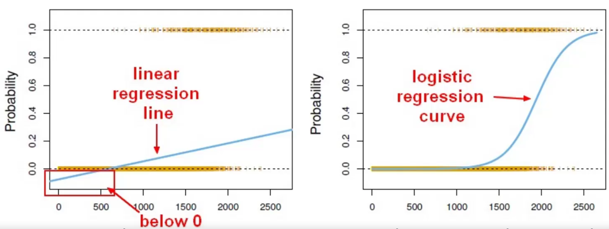
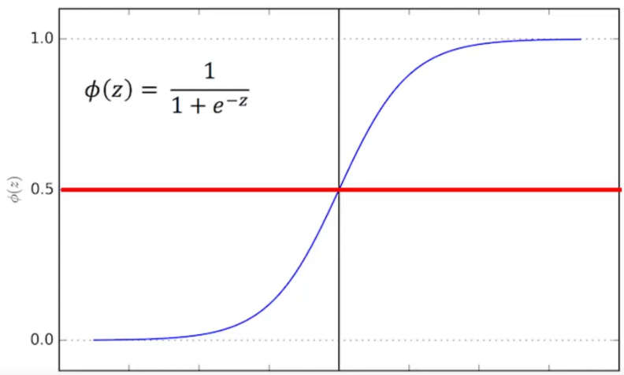

# Logistic Regression

* Uso em problemas de classificação:
    * dadas duas classes, em qual se encaixa uma nova entrada?
    * Uso em classificações binárias

* Contorna o problema da regressão linear não ser hábil para achar solução em modelo binário

fonte: Pierian Data Udemy Course

* Uso da função sigmóide
    * qualquer valor de entrada é ajustado para sair em [0,1]
    * escolhemos um valor conveniente (em geral, 0.5) e:
        * qualquer saída acima pertence à classe 1
        * qualquer valor abaixo pertence à classe 0

fonte: Pierian Data Udemy Course