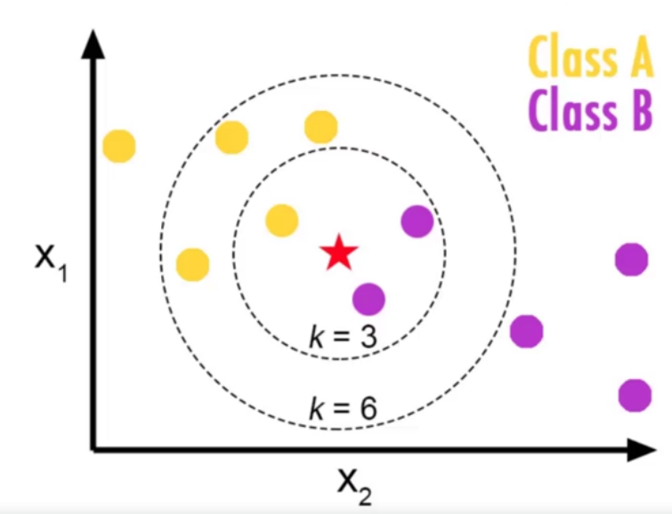
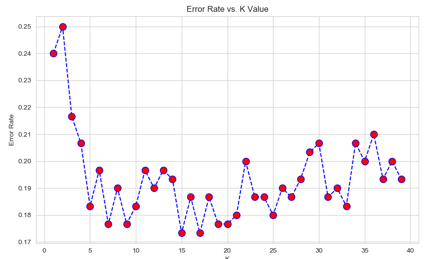

# K-Nearest Neighbors

* Algoritmo de classificação
* funcionamento - dada uma nova entrada X:
    * Calcula a distância de X a todos os pontos de treino
    * Ordena os pontos de treino por distância a X
    * Escolhe como saída a maioria de "k" pontos mais próximos
    
 
 Fonte: Pierian Data
 
 * Prós:
    * Simples
    * Treinamento trivial
    * Funciona com qualquer número de classes
    * Fácil adicionar mais dados
    * Poucos parâmetros
        * 'k'
        * distância
        
 * Contras:
    * Alto custo para prever, especialmente com datasets grandes
        * ordenar é custoso
    * Não é muito bom com várias dimensões
    * Atributos categóricos não funcionam bem
    
 * Exemplo de uso:
    * Data um dataset com colunas não especificadas, tentar classificá-las
    
 * Escolha de 'k' - Elbow Method (método do cotovelo)
    * Iterar valores para 'k' e achar um mais conveniente
    * figura costuma tomar forma de um cotovel
    