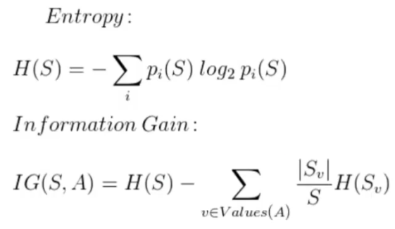

# Linear Regression

## Decision Trees
* Conjunto de observações que podem levar a diferentes resultado
* Comum grafo que possui nós, folhas e cada estado depende de uma entrada para decisão
* Tabela exemplo

* Tree exemplo da tabela acima

* Escolhas de método de divisão de opção nos nós
    * Entropia
    * Ganho de informação
    
    
---------------------------------------------------------------
## Random Forest

* Modo de melhorar a decisão de uma simples "Decision Tree"
* Devido à variancia entre aspectos disponíveis a serem avaliados
* Fazemos várias "Decision Trees" escolhendo 'm' aspectos dos 'p' aspectos totais
    * valor de 'm' geralmente é tomado como a raiz de 'p'
* Evita que um aspecto forte possa gerar Decision Trees muito semelhantes e/ou correlatas
    * deixando de fora aspectos em cada uma das Decision Trees, criamos uma Random Forest não correlacionada
    * redução da variância no modelo como um todo
