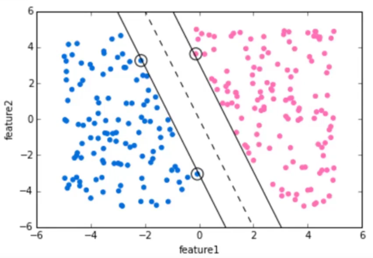
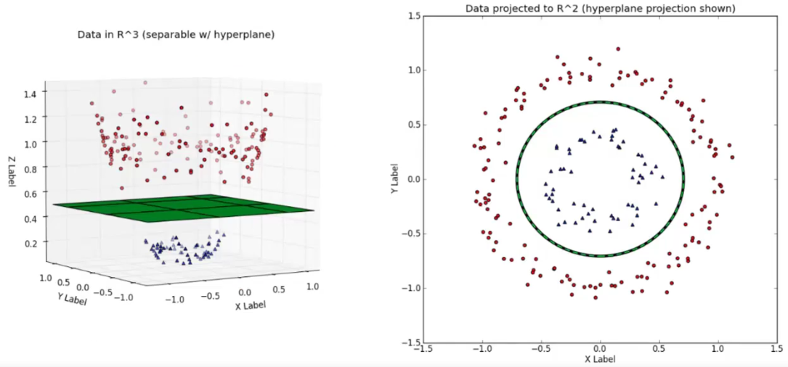

# Support Vector Machines SVM

* Aprendizado supervisionado
* Analisa e reconhece padrões
* Usado para classificação e regressão
* Método:
    * dado um conjunto de treino com duas possibilidades de categoria (classificação binária),
    SVM coloca uma nova amostra em uma dessas categorias
    * SVM é uma representação de pontos no espaço. Busca-se abrir uma divisão,
    o mais ampla o possível, entre as categorias
    * uma nova amostra é classificada com base em que lado da divisão ela se enquadra
    * Escolha de um "hiper plano" que maximize a divisão entre as classes
    * Support Vectors: pontos que estão na margem do "hiper plano" de divisão
    
    fonte: Pierian Data
 * Uso em dados não lineares:
    * Kernel Trick: aplicar outra dimensão aos dados de forma a separá-los
    
    fonte: Pierian Data
    
 * Grid Search:
    * Auxilia na escolha dos melhores parâmetros para separação de classes
    * Variando as possíveis escolhas, podemos buscar os melhores valores para solucionar o problema
    * Para SVM:
        * C: controla o custo de classificação errada em treinos
            * C alto: pequeno BIAS, alta variância
            * C pequeno: alto BIAS, baixa variância
        * gamma: relacionado com a Gaussiana do algoritmo
            * gamma alto: alto BIAS, baixa variância
            * gamma pequeno: alta variância