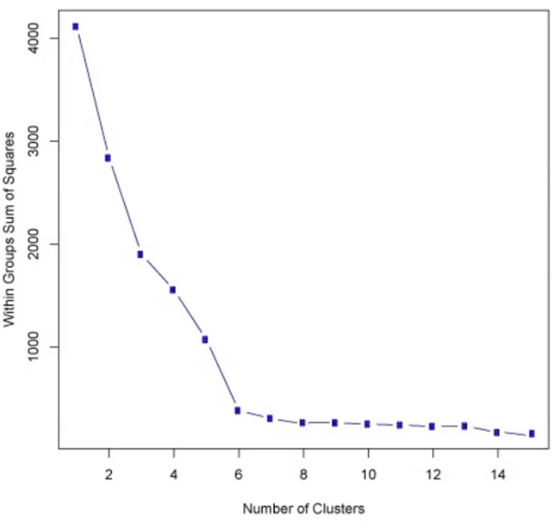

# Linear Regression

* Aprendizado não supervisionado
* "K" é o número de clusters que se deseja achar
* Método
    1. Escolha um valor para K
    2. designa aleatoriamente cada ponto para um cluster
    3. Loop: até que os clusters para de mudar:
        * para cada cluster, calcula o centróide pelo valor médio dos pontos do cluster
        * designa cada ponto para o cluster de centróide mais próximo
 * Escolha do valor de "K":
    * Problema não trivial
    * Elbow méthod:
        * computa a soma dos erros quadrados para alguns valores de K
        * essa é a soma da distância de cada membro do cluster para seu centróide
        * escolher K como o valor em que o erro cai abruptamente
        
        fonte: Pierian Data