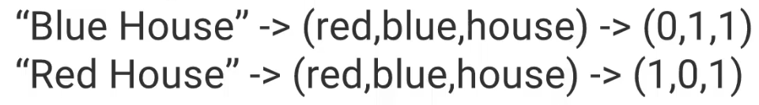
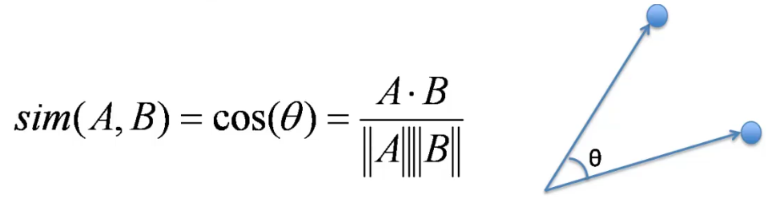
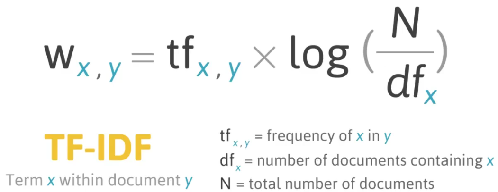

# Natural Language Processing

* Busca:
    * Compilar documentos
    * Categorizá-los
    * Comparar os dados
 * "Bag of Words"
    * junta todas as palavras presentes em um documento
    * classifica em quais documento aparecem quais palavras
    
    fonte: Pierian Data
    * usa a similaridade de cossenos para achar padrões nos documentos
    
    fonte: Pierian Data
 * Melhorando o processo: ajustar por contagem de palavras e sua frequência no grupo de todos os documentos
    * TF-IDF (Term Frequency - Inverse Document Frequency)
        * TF: importância de um termo no documento, ou seja, quantas vezes ele se repete
        * IDF: importância de um termo no conjunto de documentos
            * IDF(t) = log(D/t), com 'D' nº total de documentos e 't' nº de documentos que contém certo termo
        * TF-IDF:
        
        fonte: Pierian Data
 * Pipeline:
    * um modo de agregar todos os passos necessário para execução do método
    * exemplo no projeto
        
    
    